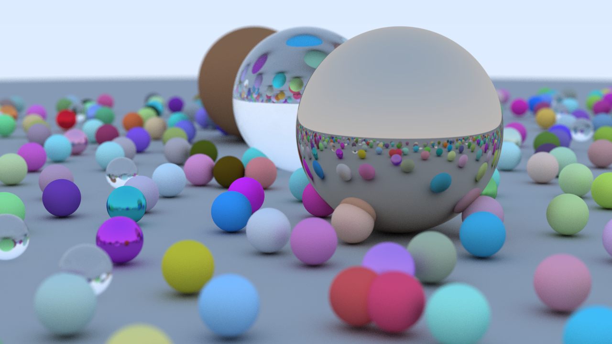

# raytracer

This is my attempt at [Ray Tracing in One Weekend](https://raytracing.github.io/books/RayTracingInOneWeekend.html) in F#. It follows a similar structure to the original with no new features or abstractions.

This image was created at 1280x720 at 256 samples per pixel. It took 7 minutes to run on my machine (Ryzen 9 7940HS, Windows 11) on a release build. A simple scene with 4 spheres renders in ~3 seconds.

This project can be run with the `dotnet run` command from the [.NET SDK](https://dotnet.microsoft.com/en-us/download).